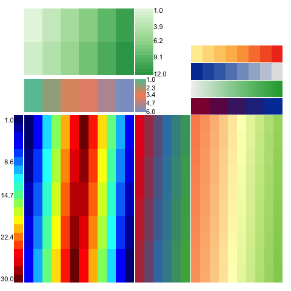
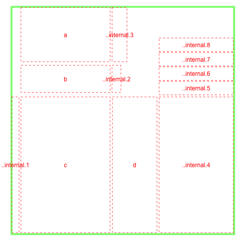

# Wheatmap

WHeatmap designs a set of languages and a layer system that allows arbitrary positioning of heatmaps programmatically.

It makes plotting complex heatmaps using natural human language.

For example,
 can be generated simply by

```R
WHeatmap(matrix(1:12,nrow=2), cmp=CMPar(brewer.name='Greens'), name='a') + 
  WHeatmap(matrix(1:6,nrow=1), Beneath(pad=0.05), cmp=CMPar(brewer.name='Set2'), name='b') +
  WHeatmap(matrix(c(1:30,30:1),nrow=5), Beneath(pad=0.05), 'c', cmp=CMPar(cmap='jet')) +
  WHeatmap(matrix(1:24,nrow=4), RightOf('c'), 'd', cmp=CMPar(brewer.name='Set1')) +
  WLegendV('c', LeftOf('c', pad=0.01), yticklabel.side='l') +
  WLegendV('b', RightOf('b', width=0.1)) + 
  WLegendV('a', RightOf('a')) + 
  WHeatmap(matrix(1:100, nrow=10), RightOf('d'), cmp=CMPar(brewer.name='RdYlGn')) +
  WColorBarH(matrix(5:1), TopOf(), cmp=CMPar(colorspace.name = 'diverge_hcl')) +
  WColorBarH(matrix(50:1), TopOf(), cmp=CMPar(colorspace.name = 'terrain_hcl')) +
  WColorBarH(matrix(1:8), TopOf(), cmp=CMPar(colorspace.name = 'sequential_hcl')) +
  WColorBarH(matrix(1:8), TopOf(), cmp=CMPar(brewer.name = 'YlOrRd'))
```

The layout looks like



More of this package can be known from [here](https://github.com/zwdzwd/wheatmap/blob/master/inst/tutorial.pdf).
